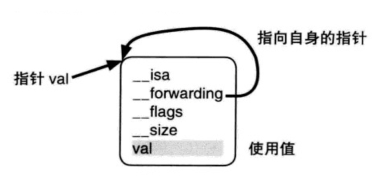

# 目录

   * [block的实质](#block的实质)
      * [block源码转换](#block源码转换)
      * [block结构体](#block结构体)
         * [struct __block_impl impl说明](#struct-__block_impl-impl说明)
         * [struct __main_block_desc_0* Desc 说明](#struct-__main_block_desc_0-desc-说明)
         * [__main_block_impl_0 构造函数说明](#__main_block_impl_0-构造函数说明)
      * [block 实质总结](#block-实质总结)
   * [block 截获局部变量和特殊区域变量](#block-截获局部变量和特殊区域变量)
      * [blcok 截获局部变量的实质](#blcok-截获局部变量的实质)
      * [使用 __block 说明符更改局部变量值](#使用-__block-说明符更改局部变量值)
      * [更改特殊区域变量值](#更改特殊区域变量值)

# block的实质

## block源码转换

oc代码

```objective-c
int main () {
    void (^myBlock)(void) = ^{
        printf("myBlock\n");
    };

    myBlock();

    return 0;
}
```

转换成c++

```c++
/* 包含 Block 实际函数指针的结构体 */
struct __block_impl {
    void *isa;
    int Flags;               
    int Reserved;        // 今后版本升级所需的区域大小
    void *FuncPtr;      // 函数指针
};

/* Block 结构体 */
struct __main_block_impl_0 {
    // impl：Block 的实际函数指针，指向包含 Block 主体部分的 __main_block_func_0 结构体
    struct __block_impl impl;
    // Desc：Desc 指针，指向包含 Block 附加信息的 __main_block_desc_0（） 结构体
    struct __main_block_desc_0* Desc;
    // __main_block_impl_0：Block 构造函数
    __main_block_impl_0(void *fp, struct __main_block_desc_0 *desc, int flags=0) {
        impl.isa = &_NSConcreteStackBlock;
        impl.Flags = flags;
        impl.FuncPtr = fp;
        Desc = desc;
    }
};

/* Block 主体部分结构体 */
static void __main_block_func_0(struct __main_block_impl_0 *__cself) {
    printf("myBlock\n");
}

/* Block 附加信息结构体：包含今后版本升级所需区域大小，Block 的大小*/
static struct __main_block_desc_0 {
    size_t reserved;        // 今后版本升级所需区域大小
    size_t Block_size;    // Block 大小
} __main_block_desc_0_DATA = { 0, sizeof(struct __main_block_impl_0)};

/* main 函数 */
int main () {
    void (*myBlock)(void) = ((void (*)())&__main_block_impl_0((void *)__main_block_func_0, &__main_block_desc_0_DATA));
    ((void (*)(__block_impl *))((__block_impl *)myBlock)->FuncPtr)((__block_impl *)myBlock);

    return 0;
}
```

## block结构体

```c++
/* Block 结构体 */
struct __main_block_impl_0 {
    // impl：Block 的实际函数指针，指向包含 Block 主体部分的 __main_block_func_0 结构体
    struct __block_impl impl;
    // Desc：Desc 指针，指向包含 Block 附加信息的 __main_block_desc_0（） 结构体
    struct __main_block_desc_0* Desc;
    // __main_block_impl_0：Block 构造函数
    __main_block_impl_0(void *fp, struct __main_block_desc_0 *desc, int flags=0) {
        impl.isa = &_NSConcreteStackBlock;
        impl.Flags = flags;
        impl.FuncPtr = fp;
        Desc = desc;
    }
};
```

从上边我们可以看出，`__main_block_impl_0` 结构体（Block 结构体）包含了三个部分：

1. 成员变量`impl`
2. 成员变量指针`Desc`指针
3. `__main_block_impl_0`构造函数

### `struct __block_impl impl`说明

第一部分 `impl` 是 `__block_impl` 结构体类型的成员变量。`__block_impl` 包含了 Block 实际函数指针 `FuncPtr`，`FuncPtr` 指针指向 Block 的主体部分，也就是 Block 对应 OC 代码中的 `^{ printf("myBlock\n"); };` 部分。还包含了标志位 `Flags`，今后版本升级所需的区域大小 `Reserved`，`__block_impl` 结构体的实例指针 `isa`

```c++
/* 包含 Block 实际函数指针的结构体 */
struct __block_impl {
    void *isa;               // 用于保存 Block 结构体的实例指针
    int Flags;               // 标志位
    int Reserved;        // 今后版本升级所需的区域大小
    void *FuncPtr;      // 函数指针
};
```

### `struct __main_block_desc_0* Desc` 说明

第二部分 Desc 是指向的是 `__main_block_desc_0` 类型的结构体的指针型成员变量，`__main_block_desc_0` 结构体用来描述该 Block 的相关附加信息：

1. 今后版本升级所需区域大小：`reserved`变量
2. Block大小: `Block_size`变量

```c++
/* Block 附加信息结构体：包含今后版本升级所需区域大小，Block 的大小*/
static struct __main_block_desc_0 {
    size_t reserved;      // 今后版本升级所需区域大小
    size_t Block_size;  // Block 大小
} __main_block_desc_0_DATA = { 0, sizeof(struct __main_block_impl_0)};
```

### `__main_block_impl_0` 构造函数说明

第三部分是 `__main_block_impl_0` 结构体（Block 结构体） 的构造函数，负责初始化 `__main_block_impl_0` 结构体（Block 结构体） 的成员变量

```c++
__main_block_impl_0(void *fp, struct __main_block_desc_0 *desc, int flags=0) {
    impl.isa = &_NSConcreteStackBlock;
    impl.Flags = flags;
    impl.FuncPtr = fp;
    Desc = desc;
}
```

关于结构体构造函数中对各个成员变量的赋值，我们需要先来看看 `main()` 函数中，对该构造函数的调用

```c++
void (*myBlock)(void) = ((void (*)())&__main_block_impl_0((void *)__main_block_func_0, &__main_block_desc_0_DATA));
```

我们可以把上面的代码稍微转换一下，去掉不同类型之间的转换，使之简洁一点：

```c++
struct __main_block_impl_0 temp = __main_block_impl_0(__main_block_func_0, &__main_block_desc_0_DATA);
struct __main_block_impl_0 myBlock = &temp;
```

这样，就容易看懂了。该代码将通过 `__main_block_impl_0` 构造函数，生成的 `__main_block_impl_0` 结构体（Block 结构体）类型实例的指针，赋值给 `__main_block_impl_0` 结构体（Block 结构体）类型的指针变量 `myBlock`

可以看到， 调用 `__main_block_impl_0` 构造函数的时候，传入了两个参数

第一个参数：`__main_block_func_0`

* 其实就是 Block 对应的主体部分，可以看到下面关于 `__main_block_func_0` 结构体的定义 ，和 OC 代码中 `^{ printf("myBlock\n"); };` 部分具有相同的表达式
* 这里参数中的 `__cself` 是指向 Block 的值的指针变量，相当于 OC 中的 `self`

```c++
/* Block 主体部分结构体 */
static void __main_block_func_0(struct __main_block_impl_0 *__cself) {
        printf("myBlock\n");
}
```

第二个参数：`__main_block_desc_0_DATA`：`__main_block_desc_0_DATA` 包含该 Block 的相关信息。
我们再来结合之前的 `__main_block_impl_0` 结构体定义

* `__main_block_impl_0` 结构体（Block 结构体）可以表述为：

```c++
struct __main_block_impl_0 {
    void *isa;               // 用于保存 Block 结构体的实例指针
    int Flags;               // 标志位
    int Reserved;        // 今后版本升级所需的区域大小
    void *FuncPtr;      // 函数指针
    struct __main_block_desc_0* Desc;      // Desc：Desc 指针
};
```

* `__main_block_impl_0` 构造函数可以表述为：

```c++
impl.isa = &_NSConcreteStackBlock;    // isa 保存 Block 结构体实例
impl.Flags = 0;        // 标志位赋值
impl.FuncPtr = __main_block_func_0;    // FuncPtr 保存 Block 结构体的主体部分
Desc = &__main_block_desc_0_DATA;    // Desc 保存 Block 结构体的附加信息
```

## block 实质总结

`__main_block_impl_0` 结构体（Block 结构体）相当于 Objective-C 类对象的结构体，`isa` 指针保存的是所属类的结构体的实例的指针。`_NSConcreteStackBlock` 相当于 Block 的结构体实例。对象 `impl.isa = &_NSConcreteStackBlock;` 语句中，将 Block 结构体的指针赋值给其成员变量 `isa`，相当于 Block 结构体的成员变量 保存了 Block 结构体的指针，这里和 Objective-C 中的对象处理方式是一致的

> 也就是说明： **Block 的实质就是对象。**
> Block 跟其他所有的 NSObject 一样，都是对象

# block 截获局部变量和特殊区域变量

## blcok 截获局部变量的实质

```objective-c
// 使用 Blocks 截获局部变量值
- (void)useBlockInterceptLocalVariables {
    int a = 10, b = 20;

    void (^myLocalBlock)(void) = ^{
        printf("a = %d, b = %d\n",a, b);
    };

    myLocalBlock();    // 输出结果：a = 10, b = 20

    a = 20;
    b = 30;

    myLocalBlock();    // 输出结果：a = 10, b = 20
}
```

从中可以看到，我们在第一次调用 `myLocalBlock();` 之后已经重新给变量 `a`、变量 `b` 赋值了，但是第二次调用 `myLocalBlock();` 的时候，使用的还是之前对应变量的值

> 这是因为 block 语法的表达式使用的是它之前声明的局部变量 `a`、变量 `b`。block 中，**block 表达式截获所使用的局部变量的值，保存了该变量的瞬时值**。所以在第二次执行 Block 表达式时，即使已经改变了局部变量 `a` 和 `b` 的值，也不会影响 Block 表达式在执行时所保存的局部变量的瞬时值
>
> 这就是 block截获局部变量值的特性

原因

```c++
struct __main_block_impl_0 {
    struct __block_impl impl;
    struct __main_block_desc_0* Desc;
    int a;
    int b;
    __main_block_impl_0(void *fp, struct __main_block_desc_0 *desc, int _a, int _b, int flags=0) : a(_a), b(_b) {
        impl.isa = &_NSConcreteStackBlock;
        impl.Flags = flags;
        impl.FuncPtr = fp;
        Desc = desc;
    }
};

static void __main_block_func_0(struct __main_block_impl_0 *__cself) {
    int a = __cself->a; // bound by copy
    int b = __cself->b; // bound by copy

    printf("a = %d, b = %d\n",a, b);
}

static struct __main_block_desc_0 {
    size_t reserved;
    size_t Block_size;
} __main_block_desc_0_DATA = { 0, sizeof(struct __main_block_impl_0)};

int main () {
    int a = 10, b = 20;

    void (*myLocalBlock)(void) = ((void (*)())&__main_block_impl_0((void *)__main_block_func_0, &__main_block_desc_0_DATA, a, b));
    ((void (*)(__block_impl *))((__block_impl *)myLocalBlock)->FuncPtr)((__block_impl *)myLocalBlock);

    a = 20;
    b = 30;

    ((void (*)(__block_impl *))((__block_impl *)myLocalBlock)->FuncPtr)((__block_impl *)myLocalBlock);
}
```

可以看到 `__main_block_impl_0` 结构体（Block 结构体）中多了两个成员变量 `a` 和 `b`，这两个变量就是 block 截获的局部变量。 `a` 和 `b` 的值来自与 `__main_block_impl_0` 构造函数中传入的值

还可以看出 `__main_block_func_0`（保存 Block 主体部分的结构体）中，变量 `a`、`b` 的值使用的 `__cself` 获取的值。
而 `__cself->a`、`__cself->b` 是通过值传递的方式传入进来的，而不是通过指针传递。这也就说明了 `a`、`b` 只是 block 内部的变量，改变 block 外部的局部变量值，并不能改变 Block 内部的变量值

## 使用 `__block` 说明符更改局部变量值

```objective-c
// 使用 __block 说明符修饰，更改局部变量值
- (void)useBlockQualifierChangeLocalVariables {
    __block int a = 10, b = 20;

    void (^myLocalBlock)(void) = ^{
        a = 20;
        b = 30;

        printf("a = %d, b = %d\n",a, b);    // 输出结果：a = 20, b = 30
    };

    myLocalBlock();
}
```

从中我们可以发现：通过 `__block` 修饰的局部变量，可以在 block 的主体部分中改变值

转换源码分析：

```c++
struct __Block_byref_a_0 {
    void *__isa;
    __Block_byref_a_0 *__forwarding;
    int __flags;
    int __size;
    int a;
};

struct __Block_byref_b_1 {
    void *__isa;
    __Block_byref_b_1 *__forwarding;
    int __flags;
    int __size;
    int b;
};

struct __main_block_impl_0 {
    struct __block_impl impl;
    struct __main_block_desc_0* Desc;
    __Block_byref_a_0 *a; // by ref
    __Block_byref_b_1 *b; // by ref
    __main_block_impl_0(void *fp, struct __main_block_desc_0 *desc, __Block_byref_a_0 *_a, __Block_byref_b_1 *_b, int flags=0) : a(_a->__forwarding), b(_b->__forwarding) {
        impl.isa = &_NSConcreteStackBlock;
        impl.Flags = flags;
        impl.FuncPtr = fp;
        Desc = desc;
    }
};

static void __main_block_func_0(struct __main_block_impl_0 *__cself) {
    __Block_byref_a_0 *a = __cself->a; // bound by ref
    __Block_byref_b_1 *b = __cself->b; // bound by ref

    (a->__forwarding->a) = 20;
    (b->__forwarding->b) = 30;

    printf("a = %d, b = %d\n",(a->__forwarding->a), (b->__forwarding->b));
}

static void __main_block_copy_0(struct __main_block_impl_0*dst, struct __main_block_impl_0*src) {_Block_object_assign((void*)&dst->a, (void*)src->a, 8/*BLOCK_FIELD_IS_BYREF*/);_Block_object_assign((void*)&dst->b, (void*)src->b, 8/*BLOCK_FIELD_IS_BYREF*/);}

static void __main_block_dispose_0(struct __main_block_impl_0*src) {_Block_object_dispose((void*)src->a, 8/*BLOCK_FIELD_IS_BYREF*/);_Block_object_dispose((void*)src->b, 8/*BLOCK_FIELD_IS_BYREF*/);}

static struct __main_block_desc_0 {
    size_t reserved;
    size_t Block_size;
    void (*copy)(struct __main_block_impl_0*, struct __main_block_impl_0*);
    void (*dispose)(struct __main_block_impl_0*);
} __main_block_desc_0_DATA = { 0, sizeof(struct __main_block_impl_0), __main_block_copy_0, __main_block_dispose_0};

int main() {
    __attribute__((__blocks__(byref))) __Block_byref_a_0 a = {(void*)0,(__Block_byref_a_0 *)&a, 0, sizeof(__Block_byref_a_0), 10};
    __Block_byref_b_1 b = {(void*)0,(__Block_byref_b_1 *)&b, 0, sizeof(__Block_byref_b_1), 20};

    void (*myLocalBlock)(void) = ((void (*)())&__main_block_impl_0((void *)__main_block_func_0, &__main_block_desc_0_DATA, (__Block_byref_a_0 *)&a, (__Block_byref_b_1 *)&b, 570425344));
    ((void (*)(__block_impl *))((__block_impl *)myLocalBlock)->FuncPtr)((__block_impl *)myLocalBlock);

    return 0;
}
```

可以看到，只是加上了一个 `__block`，代码量就增加了很多

我们从 `__main_block_impl_0` 开始说起

```c++
struct __main_block_impl_0 {
    struct __block_impl impl;
    struct __main_block_desc_0* Desc;
    __Block_byref_a_0 *a; // by ref
    __Block_byref_b_1 *b; // by ref
    __main_block_impl_0(void *fp, struct __main_block_desc_0 *desc, __Block_byref_a_0 *_a, __Block_byref_b_1 *_b, int flags=0) : a(_a->__forwarding), b(_b->__forwarding) {
        impl.isa = &_NSConcreteStackBlock;
        impl.Flags = flags;
        impl.FuncPtr = fp;
        Desc = desc;
    }
};
```

我们在 `__main_block_impl_0` 结构体中可以看到： 原 OC 代码中，被 `__block` 修饰的局部变量 `__block int a`、`__block int b` 分别变成了 `__Block_byref_a_0`、`__Block_byref_b_1` 类型的结构体指针 `a`、结构体指针 `b`。这里使用结构体指针 `a` 、结构体指针 `b` 说明 `_Block_byref_a_0`、`__Block_byref_b_1` 类型的结构体并不在 `__main_block_impl_0` 结构体中，而只是通过指针的形式引用，这是为了可以在多个不同的 Block 中使用 `__block` 修饰的变量

`__Block_byref_a_0`、`__Block_byref_b_1` 类型的结构体声明如下：

```c++
struct __Block_byref_a_0 {
    void *__isa;
    __Block_byref_a_0 *__forwarding;
    int __flags;
    int __size;
    int a;
};

struct __Block_byref_b_1 {
    void *__isa;
    __Block_byref_b_1 *__forwarding;
    int __flags;
    int __size;
    int b;
};
```

拿第一个 `__Block_byref_a_0` 结构体定义来说明，`__Block_byref_a_0` 有 5 个部分：

* `__isa`：标识对象类的 `isa` 实例变量
* `__forwarding`：传入变量的地址
* `__flags`：标志位
* `__size`：结构体大小
* `a`：存放实变量 `a` 实际的值，相当于原局部变量的成员变量（和之前不加__block修饰符的时候一致）

再来看一下 `main()` 函数中，`__block int a`、`__block int b` 的赋值情况

顺便把代码整理一下，使之简易一点：

```c++
__Block_byref_a_0 a = {
    (void*)0,
    (__Block_byref_a_0 *)&a, 
    0, 
    sizeof(__Block_byref_a_0), 
    10
};

__Block_byref_b_1 b = {
    0,
    &b, 
    0, 
    sizeof(__Block_byref_b_1), 
    20
};
```

还是拿第一个`__Block_byref_a_0 a` 的赋值来说明

可以看到 `__isa` 指针值传空，`__forwarding` 指向了局部变量 `a` 本身的地址，`__flags` 分配了 0，`__size` 为结构体的大小，`a` 赋值为 10。下图用来说明 `__forwarding` 指针的指向情况

<div align="center">    

</div>

这下，我们知道 `__forwarding` 其实就是局部变量 `a` 本身的地址，那么我们就可以通过 `__forwarding` 指针来访问局部变量，同时也能对其进行修改了

来看一下block 主体部分对应的 `__main_block_func_0` 结构体来验证一下

```c++
static void __main_block_func_0(struct __main_block_impl_0 *__cself) {
    __Block_byref_a_0 *a = __cself->a; // bound by ref
    __Block_byref_b_1 *b = __cself->b; // bound by ref

    (a->__forwarding->a) = 20;
    (b->__forwarding->b) = 30;

    printf("a = %d, b = %d\n",(a->__forwarding->a), (b->__forwarding->b));
}
```

可以看到 `(a->__forwarding->a) = 20;` 和 `(b->__forwarding->b) = 30;` 是**通过指针取值的方式来改变了局部变量的值**。这也就解释了通过 `__block` 来修饰的变量，在block 的主体部分中改变值的原理其实是：通过**指针传递**的方式

## 更改特殊区域变量值

除了通过 `__block` 说明符修饰的这种方式修改局部变量的值之外，还有一些特殊区域的变量，我们也可以在 Block 的内部将其修改

这些特殊区域的变量包括：**静态局部变量**、**静态全局变量**、**全局变量**

我们还是通过 OC 代码和 C++ 源码来说明一下：

OC代码：

```objective-c
int global_val = 10; // 全局变量
static int static_global_val = 20; // 静态全局变量

int main() {
    static int static_val = 30; // 静态局部变量

    void (^myLocalBlock)(void) = ^{
        global_val *= 1;
        static_global_val *= 2;
        static_val *= 3;

        printf("static_val = %d, static_global_val = %d, global_val = %d\n",static_val, static_global_val, static_val);
    };

    myLocalBlock();

    return 0;
}
```

C++ 代码：

```c++
int global_val = 10;
static int static_global_val = 20;

struct __main_block_impl_0 {
    struct __block_impl impl;
    struct __main_block_desc_0* Desc;
    int *static_val;
    __main_block_impl_0(void *fp, struct __main_block_desc_0 *desc, int *_static_val, int flags=0) : static_val(_static_val) {
        impl.isa = &_NSConcreteStackBlock;
        impl.Flags = flags;
        impl.FuncPtr = fp;
        Desc = desc;
    }
};

static void __main_block_func_0(struct __main_block_impl_0 *__cself) {
    int *static_val = __cself->static_val; // bound by copy
    global_val *= 1;
    static_global_val *= 2;
    (*static_val) *= 3;

    printf("static_val = %d, static_global_val = %d, global_val = %d\n",(*static_val), static_global_val, (*static_val));
}

static struct __main_block_desc_0 {
    size_t reserved;
    size_t Block_size;
} __main_block_desc_0_DATA = { 0, sizeof(struct __main_block_impl_0)};

int main() {
    static int static_val = 30;

    void (*myLocalBlock)(void) = ((void (*)())&__main_block_impl_0((void *)__main_block_func_0, &__main_block_desc_0_DATA, &static_val));
    ((void (*)(__block_impl *))((__block_impl *)myLocalBlock)->FuncPtr)((__block_impl *)myLocalBlock);

    return 0;

}
```

在 `__main_block_impl_0` 结构体中，将静态局部变量 `static_val` 以指针的形式添加为成员变量，而静态全局变量 `static_global_val`、全局变量 `global_val` 并没有添加为成员变量

再来看一下 Block 主体部分对应的 `__main_block_func_0` 结构体部分。静态全局变量 `static_global_val`、全局变量 `global_val` 是直接访问的，而静态局部变量 `static_val` 则是通过**指针传递**的方式进行访问和赋值

```objective-c
static void __main_block_func_0(struct __main_block_impl_0 *__cself) {
    int *static_val = __cself->static_val; // bound by copy
    global_val *= 1;
    static_global_val *= 2;
    (*static_val) *= 3;

    printf("static_val = %d, static_global_val = %d, global_val = %d\n",(*static_val), static_global_val, (*static_val));
}
```

